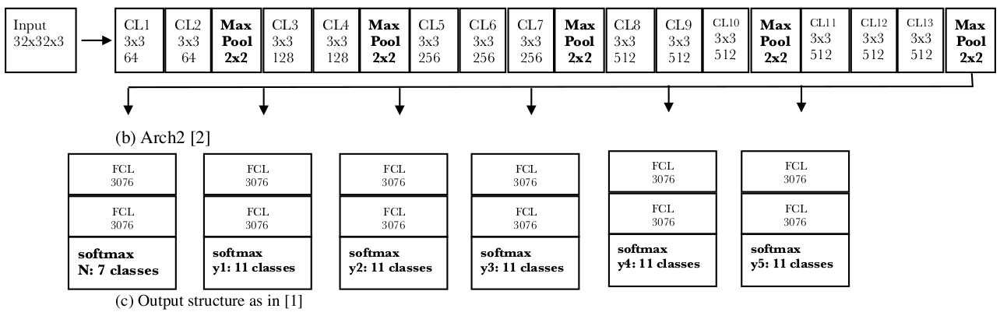
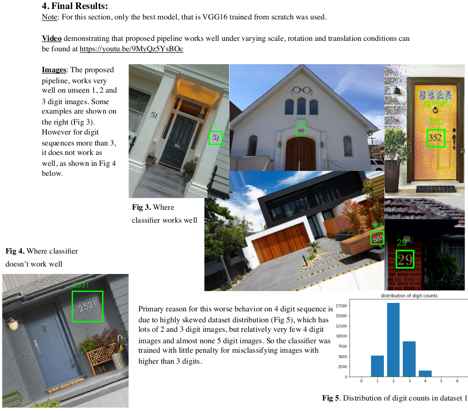

### Multi Digit Detection Natural Scene

#### Following architecture was used (based on VGG16 and Goodfellow et al 2014)

**Implementation** worked well on most images tested.  
Example Results  

- All training steps could be seen in Train_FullyTrainVGG16_Dataset1_2xCrops_AugmentedWithFalseImages_withRandomRotations.ipynb

- Final Report on this project should be found in this folder, with name:
  - Final_Report.pdf
    - This report has links to the presentation video and demo video

- The full environment, in which this project was developed could be found in:
  - requirements.txt

- Unfortunately Github doesn't host large files (>100MB). Hence trained model couldn't be uploaded. 
  - But it can downloaded from [this link](https://1drv.ms/u/s!Ai_USJWaRTc6iIBOkYyNdMkYSvMqLA)
    - After download, this should be placed as ./trained_models/multi_digit_classifier_FullyTrainVGG16_Dataset1_2xCrops_AugmentedWithFalseImages_withRandomRotations

- The model is included with this submission. It should be found at:
  - ./trained_models/multi_digit_classifier_FullyTrainVGG16_ReducedNetwork_Dataset1_2xCrops_AugmentedWithFalseImages_withRandomRotations.h5

- **To test your images** (after downloading the model)  
  python run_v3.py \[-h\] -i IMAGE \[-r ROTATION\] \[-md MINDIM_SIZE\] \[-n N_EXPANSIONS\]

  optional arguments:  
  -h, --help            show this help message and exit  
  -i IMAGE, --image IMAGE  
                        Path to the image  
  -r ROTATION, --rotation ROTATION  
                        Rotation to be applied to image  
  -md MINDIM_SIZE, --minDim_size MINDIM_SIZE  
                        max pixel limit on minimum dimension of image (whether  
                        width or height)  
  -n N_EXPANSIONS, --n_expansions N_EXPANSIONS  
                        number of box size expansions to be applied  

**References**:
[1] "Multi-Digit Number Recognition from Street View Imagery using Deep Convolutional Neural Networks" Goodfellow et al. 2014  
[2] “Very Deep Convolutional Networks for Large-Scale Image Recognition”, Karen Simonyan, Andrew Zisserman 2015.  
[3] Pre-trained VGG16 on ImageNet. https://keras.io/applications/#vgg16  
[4] Batch Normalization, Sergey et al 2015  
[5] Delving Deep into Rectifiers, He et al 2015  
[6] Dropout, Srivastava et al.  
[7] Street View House Numbers (SVHN) Dataset  
[8] Google Street View Data Set  
[9] On the importance of initialization and momentum in deep learning, Sutskevar 2013  
[10] http://rodrigob.github.io/are_we_there_yet/build/classification_datasets_results.html#5356484e  
